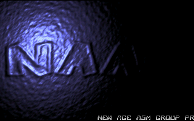

# NAAGTRO 2.0

In 2001 I wrote a simple intro for NAAG, the now-defunct New Age Assembler Group 
that I was a member of.

This is a reimplementation in C of the original NAAG intro. 22 years later
I really don't want to deal with Assembler anymore, but I still want to
play around with MS-DOS and old demoscene stuff, and to contribute to the retro
community.

The remake is mostly accurate with two exceptions: the scroller font and the light
trajectory are different. The scroller text is kept original.

    

## Motivation

- Nostalgia for the 1990s demoscene!

## Installation instructions

To compile NAAGTRO, use the [DJGPP](https://github.com/andrewwutw/build-djgpp) 
cross compiler. Enter the build directory, and run the following commands. 
Replace the path to DJGPP with your own.

    naagtro > DJGPP_DIR=/home/mikolaj/local/opt/djgpp-12.1.0
    naagtro > source ${DJGPP_DIR}/setenv
    naagtro > cd build
    
    naagtro/build > cmake -D CMAKE_C_COMPILER=${DJGPP_DIR}/i586-pc-msdosdjgpp/bin/gcc ..
    naagtro/build > make

## Required dependencies

No dependencies other than DJGPP, build-essentials and cmake.

## Future plans

- Be able to compile natively in MS-DOS (with Turbo C, Watcom, etc.)
- Be able to build for Linux and modern Windows (with SDL, etc.)
- Support video modes other than VGA 13h
- Be able to render off screen to JPEG files
- Add more special effects
- Add music (with Allegro game library, etc.)

## Q&A

1. I built naagtro.exe, what now?

    DJGPP generates code for protected mode so you need a DOS extender. Download
    [CWSDPMI](https://web.archive.org/web/20151217064947/http://homer.rice.edu/~sandmann/cwsdpmi/csdpmi7b.zip),
    unpack it and place CWSDPMI.exe in the build directory.

2. How do I run NAAGTRO in 2023 and beyond?

    If you don't have access to a DOS PC, use emulation, for example [DOSBox](http://www.dosbox.com/).
    Personally for development purposes I switch between DOSBox and VirtualBox 
    with Windows 98, and for running the final product I use a Pentium II system.

3. Why CMake, is that not overkill?

    No. CMake files are understood by IDEs, for example my personal favorite QtCreator.

4. I have a problem XYZ. How do I get help?

    Feel free to drop me a message if you encounter any issues with NAAGTRO.
